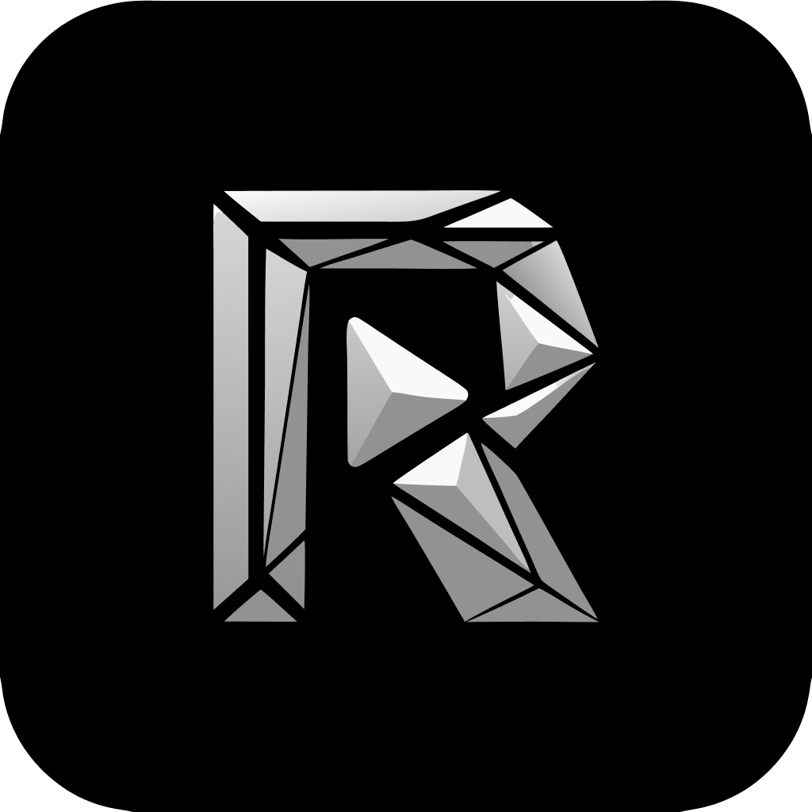

<div align="center">



# Resonance

### Premium Hybrid Music Streaming App for Windows & Android

<br/>

[](https://github.com/ChronoTcs/resonance/releases)
[](LICENSE)
[](https://github.com/ChronoTcs/resonance/releases)
[](https://github.com/ChronoTcs/resonance)

<br/>

[**Download**](#download-now) · [**Features**](#features) · [**Architecture**](#architecture) · [**Build Instructions**](#building) · [**Support**](#support-the-project)

</div>

---

> [!NOTE]
> **Solo Developer Project** — Resonance is designed, developed, and maintained independently by **ChronoTechs**.  
> If YouTube Music is unavailable in your region, a **VPN or proxy** connected to a supported region may be required.

---

<div align="center">

<h1><a id="download-now"></a>Download Now</h1>

<table align="center">
  <tr>
    <th align="center">GitHub</th>
  </tr>
  <tr>
    <td align="center">
      <a href="https://github.com/ChronoTcs/resonance/releases">
        
      </a>
    </td>
  </tr>
</table>

</div>

---

<div align="center">

<h1><a id="features"></a>Features</h1>

<table>
  <tr>
    <td width="50%" valign="top">

#### 🎵 Playback & Audio System
- **Dual-Engine Hybrid Playback**: Seamlessly handles local audio formats (`.mp3`, `.flac`, `.m4a`, `.wav`) and live online YouTube music streams.
- **Hardware Equalizer**: 9-band hardware equalizer with custom presets ("Flat", "Bass Boost", "Vocal") and customizable sliders.
- **Floating Overlay & Mini Player**: Standardized mini player & picture-in-picture floating overlay for desktop & mobile.

</td>
<td width="50%" valign="top">

#### ⚡ YouTube Resolver
- **Windows IPC Subprocess Bridge**: Outsources YouTube deciphering and audio stream fetching to a Python daemon (`resonance_downloader.py` running `yt-dlp`).
- **Android Native Deobfuscation**: Decrypts signature cipher keys natively using a MethodChannel calling `CipherDeobfuscator` in Kotlin/Java.
- **Automatic HD Cover Art**: Upgrades thumbnails to 1080p square artwork with 1:1 iTunes metadata enrichment.

</td>
</tr>
<tr>
<td width="50%" valign="top">

#### 📜 Lyrics & Metadata
- **LRCLIB Sync & Translation**: Synchronized lyrics scrolling with automatic multi-language translation caching.
- **Sidecar JSON Metadata**: High-speed offline caching for track details, artwork, and album titles.

</td>
<td width="50%" valign="top">

#### 💾 Storage & Caching
- **Granular Domain Storage**: Partitioned local music, stream cache, and system app cache directories.
- **SQLite Database**: Offline-first storage for track metadata, playlists, and playback history.

</td>
</tr>
</table>

</div>

---

<div align="center">

<h1><a id="architecture"></a>Architecture</h1>

</div>

Resonance follows a **Feature-First + Clean Architecture** structure for optimal testability and maintainability:

```text
lib/
├── core/                  # Shared utilities, constants, design widgets & global services
│   ├── application/       # Global application providers (AppConfig, Permissions)
│   ├── constants/         # AppConstants and remote repository endpoint configurations
│   ├── data/              # Storage services, cache manager, RPC services
│   ├── domain/            # Core domain models (MediaItem)
│   ├── utils/             # AppIcons, PathUtils, ThumbnailUtils, Theme tokens
│   └── widgets/           # Reusable UI controls (ResonanceButton, MediaArtworkWidget)
└── features/              # Feature-isolated modules
    ├── download/          # Download queue, Python IPC bridge, download notifier
    ├── explore/           # YouTube search, community feed parsers, stream resolver
    ├── library/           # Local file scanner, directory parser, SQLite store
    ├── lyrics/            # Synced LRC parser, translation engine, LRCLIB API
    ├── player/            # Fullscreen view, docked mini player, audio state notifier
    ├── playlist/          # Custom playlist manager, track reordering
    └── settings/          # System maintenance, cache manager UI, auto updates
```

---

<div align="center">

<h1><a id="building"></a>Building & Compilation</h1>

</div>

### Prerequisites
- **Flutter SDK**: `^3.11.1`
- **Python**: `3.10+` (Windows bridge development)
- **FFmpeg**: Placed inside `python_engine/bin/`

---

### Building for Production

#### 🤖 Android (Optimized ABI Split)
To produce size-optimized APKs without bundling unused native `libmpv` architectures (~70MB size reduction):
```bash
flutter build apk --split-per-abi --obfuscate --split-debug-info=build/app/outputs/symbols
```

#### 🪟 Windows Desktop
```bash
flutter build windows --release
```
*Note: Ensure `resonance_downloader.exe` and FFmpeg binaries (`bin/` directory with `ffmpeg.exe` and `ffprobe.exe`) are placed adjacent to `resonance.exe` in the release build folder.*

---

<div align="center">

<h1><a id="support-the-project"></a>Support the Project</h1>

If you enjoy using Resonance and would like to support development or report an issue:

<br/>

[](https://linktr.ee/Chronosz)
[](https://github.com/ChronoTcs/resonance/issues)

<br/>

### Developed with ❤️ by [ChronoTechs](https://github.com/ChronoTcs)

</div>
